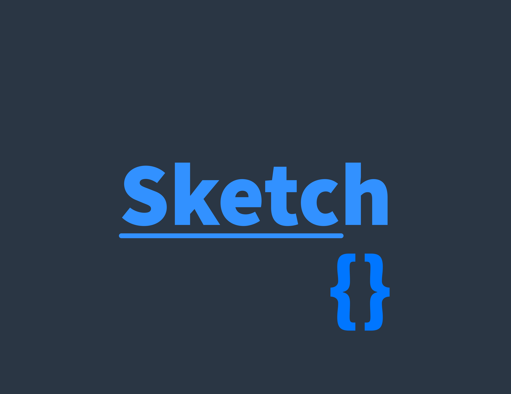

import {Cards} from "nextra/components";

# Kumaraswamy

Hey, I'm a 15 y/o. I'm a hobbyist who enjoys working with Kotlin/Java and crafting apps for Android.

I have a lot of interest in learning new things, algorithms, tools, fun projects, etc.

<Cards num={2}>
    <Cards.Card
        image
        arrow
        title="Sketch language"
        href="https://github.com/XomaDev/sketch">
        <></>
    </Cards.Card>
    <Cards.Card
        image
        arrow
        title="Floats" href="/docs/blog-theme/start"
        href="https://github.com/XomaDev/Floats">
        <></>
    </Cards.Card>
</Cards>
<Cards>
    <Cards.Card title="Sketch is a language with Kotlin-style syntax intended for fun"
                href="https://github.com/XomaDev/sketch"/>
    <Cards.Card title="Free and open-source Android app for file sharing on local networks"
                href="https://github.com/XomaDev/Floats"/>
</Cards>

---

- GitHub [@XomaDev](https://github.com/XomaDev)
- Telegram [@KumaraswamyBG](https://t.me/KumaraswamyBG)
- Email hi@themelon.space